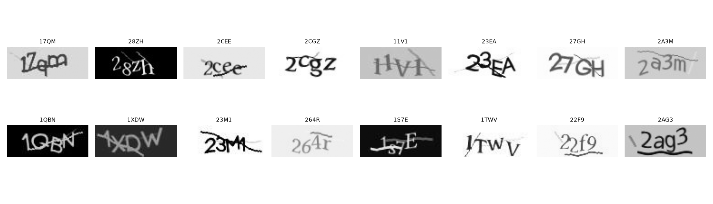
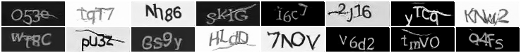
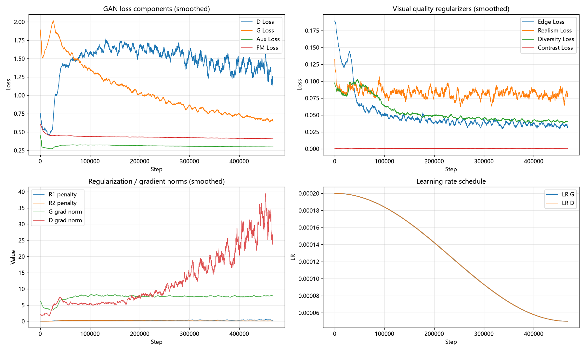
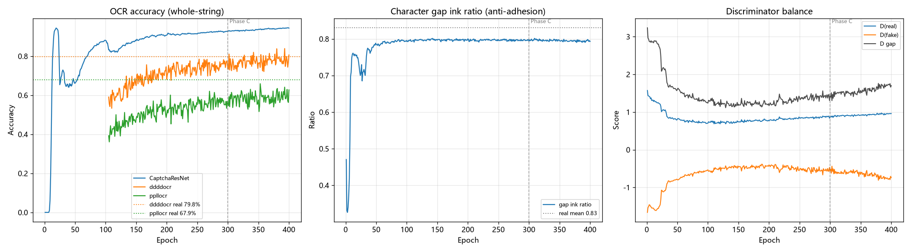

# Captcha Generation AI

An **AC-GAN** (Auxiliary Classifier GAN) based generator for 4-character
alphanumeric captchas. The goal is not merely to "produce nice-looking images",
but to satisfy three requirements at once:

1. **Human readable** — sharp glyphs, crisp edges, realistic background noise;
2. **Machine profile close to real data** — whole-string accuracy, character
   error rate and confusion distribution of third-party OCRs (ddddocr / ppllocr)
   on generated images should match the real training data;
3. **Diversity per label** — the same text can be rendered with different
   noise/background, without overfitting the label.

[中文文档](README.md) | **English**

---

## Gallery

Real training samples (top) vs. model-generated samples (bottom):





> All images are 35×90 grayscale, 4 characters, charset `0-9 + A-Z` (36 classes).

---

## Results

### Key Metrics (400 epochs / 468,000 steps)

| Metric | Real data | Generated (training log) | Generated (independent eval, n=2000) |
|---|---|---|---|
| CaptchaResNet whole-string acc | ~99% (trained on train set, readability proxy only) | **94.4%** | **94.6%** |
| ddddocr whole-string acc | **79.8%** | **80.6%** | 79.6% |
| ppllocr whole-string acc | **67.9%** | 62.7% | 59.7% |
| Gap ink ratio (char adhesion) | 0.84 / 0.96 / 0.69 | **0.79** | 0.84 |
| Per-character error-rate MAE | — | — | **0.045** |
| Out-of-vocabulary prediction rate | 0.066 / 0.067 | 0.074 / 0.041 | PASS |

ddddocr recognizes generated images at almost exactly the same rate as real
ones (~80%), meaning generated captchas are nearly indistinguishable from real
data from the machine's point of view. Meanwhile `M6 per-character error-rate
MAE < 0.05` shows that **which characters are misread** also matches the real
distribution.

### Milestone Evaluation (M1-M8)

`evaluate_generated.py` compares the generated-image profile against
`confusion_profile.json` (a full-corpus profile of real data). Release results:

```
PASS M1 ddddocr acc ratio fake/real: 0.9965   target[0.85, 1.05]
PASS M2 ddddocr char error ratio:    0.8531   target[0.8, 1.3]
PASS M1 ppllocr acc ratio fake/real: 0.8789   target[0.85, 1.05]
PASS M2 ppllocr char error ratio:    1.2355   target[0.8, 1.3]
INFO M3 confusion-distribution JS:   0.3767   (reference <0.1, lower = closer to real)
PASS M4 <LEN> error ratio (match real): 0.73 / 1.22   target[0.5, 2.0]
PASS M5 OOV rate:                    0.074 / 0.041
PASS M6 per-char error-rate MAE:     0.0446   target[<0.05]
PASS M7 gap ink ratio (match real):  0.8388   target real mean ±0.15
PASS M8 CaptchaResNet whole-string:  0.9460   target[>=0.85]
```

> M3 is a reference metric: the generated confusion distribution does not yet
> fully coincide with the real profile and can converge further by extending
> Phase C (confusion soft-target) training.

### Training Loss Curves





- **G/D loss**: during G warm-up only auxiliary losses are active; G loss rises
  when the adversarial weight is introduced (expected) and then stabilizes
  around 0.6-0.7. D loss stays around 1.2-1.6.
- **Visual regularizers**: Edge / Realism / Diversity all converge; Contrast loss
  is near 0, meaning generated image std already falls inside the real data
  distribution band.
- **D grad norm** grows in late training but training remains stable (gradient
  clipping); R1/R2 stay O(1).
- **OCR curves**: Phase A (Ep1-100) uses only CaptchaResNet guidance; third-party
  OCRs join at Ep100, and ddddocr reaches 80.6% at Ep400, essentially matching
  the real-data 79.8%.
- **Gap ink ratio**: stable at the real level (0.79-0.84) throughout — no hard
  cuts between characters.

---

## Key Challenge: Readable Captchas under Noisy Labels

### 1. Where the Label Noise Comes From

Full-corpus analysis of the 149,888 training images (599,552 characters) shows
three main sources of label noise:

| Noise type | Observed phenomenon | Damage to training |
|---|---|---|
| Random case annotation | Upper/lowercase of the same letter appears randomly, sometimes mixed within one label | One image maps to multiple contradictory labels; the model is forced to "flip a coin" among 62 classes |
| Non-uniform character distribution | Character `0` never appears; `1/5/O` occur only ~5,700 times (uniform expectation ~16,600) | Uniform sampling generates characters the training set never taught; quality is uncontrollable |
| Visually ambiguous labels | The real annotations contain pairs that even OCRs cannot separate (O/0, I/L/T/1, C/E — 26 empirically confusable pairs) | Forcing the model to "tell them apart" means directly fitting annotation noise |

In addition, character adhesion, background interference lines and handwriting
style make the pixel-to-label mapping inherently many-to-one.
**"Cleaning" the labels is neither possible nor desirable** — it would discard
the distributional characteristics of real data.

### 2. Strategy: Turn Noise into Part of the Supervision Signal

1. **Label unification**: map everything to uppercase 36 classes, eliminating
   contradictory case supervision outright.
2. **Real error profile as the golden standard**: run ddddocr + ppllocr over the
   full real corpus to produce `confusion_profile.json` — per-character error
   rate `error_rate`, directed confusion distribution `confusion_dist`, 26
   empirically confusable pairs, and label distribution `label_counts`.
   All downstream supervision is referenced to "what real machines do on real
   data" instead of assuming labels are 100% clean.
3. **96-cell character-level evidence weight table** (`adaptive_ocr.py`):
   three OCRs vote per character position to decide the loss weight of that
   position. Even if the label itself is ambiguous, as long as multiple OCRs
   agree on a character, that position still receives gradient; when nothing
   matches, a floor weight keeps the readability gradient alive. The model thus
   learns the "well-evidenced reading" instead of guessing the noisy label.
4. **Phase C confusion soft targets**: in late training the one-hot target is
   replaced by `y_soft = (1-ε)·δ + ε·confusion_dist` — the model need not exceed
   the discriminability of the real annotation; it "makes the same mistakes" at
   the same ambiguous boundaries as real data.
5. **Anti-cheating (Goodhart's law)**: directly optimizing OCR accuracy induces
   adversarial samples that fool a specific OCR. The cheat threshold is set at
   real accuracy **+5%**, together with a "high-confidence loner" penalty
   (down-weight when only CaptchaResNet strongly hits while third-party OCRs
   all miss), so optimization targets human readability, not machine deception.
6. **Cold start + curriculum learning**: D pre-training → G warm-up → gradual
   adversarial training; Phase A uses CaptchaResNet to bootstrap glyphs, Phase B
   adds third-party OCRs for anti-cheating — avoiding multi-model "voting" on
   noisy labels from the very beginning.

### 3. Outcome

- On characters that real annotations themselves cannot disambiguate, the
  generated images show the same magnitude and direction of errors as real data:
  `M6 per-character error-rate MAE = 0.045` (target < 0.05);
- ddddocr: 80.6% on generated vs. 79.8% on real — nearly indistinguishable from
  the machine's perspective;
- The readability guard `CaptchaResNet ≥ 85%` is preserved (actual 94.6%) —
  clarity is not sacrificed for resemblance.

> Core conclusion: under noisy labels we do not chase "100% correct reading".
> Instead the model learns **readability and ambiguous boundaries consistent
> with real data** — closer to the true distribution than a "too clean" model
> trained on scrubbed labels.

---

## Architecture

### Generator (~6M parameters)

```
z (256) ─┐
         ├─► cond_proj(512) ─► Linear ─► 4×6 feature ─► Bottleneck
labels ──┘                                          │
                                    Self-Attention ◄┘
                                            │
        CondUpBlock: 4×6 → 8×12 → 16×24    │ (FiLM conditioning + learnable noise)
                                            ▼
                          Upsample 35×90 ─► Conv×2 ─► NoiseInjection
                                            ▼
                                    Conv 1×1 ─► tanh ─► (B,1,35,90)
```

- Small init projection (512→6144) prevents a large matrix from memorizing
  training-set statistics;
- FiLM injects the text condition at every resolution level;
- Per-channel **learnable noise gain** is injected at both training and
  inference time, ensuring same-label diversity;
- No skip connections, so overfit encoder features cannot be reused directly.

### Discriminator (AC-GAN)

- 4 spectral-normalized conv layers + InstanceNorm + Minibatch StdDev;
- **Per-position auxiliary heads**: pooled features are split by width into 4
  columns, each classifying one character position — enforcing spatial
  separation of characters and alleviating adhesion;
- ReACGAN hypersphere projection (L2-normalized aux head inputs) stabilizes
  AC-GAN training.

### EMA

Exponential moving average of generator weights (decay=0.999), with BN running
statistics synchronized as well. Inference/sampling uses EMA weights by default.

---

## Training Strategy

### Losses

| Loss | Purpose |
|---|---|
| Hinge adversarial | Real/fake discrimination with SpectralNorm Lipschitz constraint |
| R1 / R2 gradient penalty | Balance discriminator gradients on real/fake data |
| Aux per-position CE | Teach the generator to write correct characters |
| FM feature matching | Match real feature statistics in discriminator intermediate layers |
| Edge (Sobel) | Enforce sharp strokes, prevent blur |
| Contrast (bidirectional) | Keep per-image std inside the real distribution band; penalize too high/low |
| Realism | Match pixel mean/std/gradient statistics |
| Diversity | Lower bound on L1 distance between two noises for the same label; prevent mode collapse |
| OCR (curriculum) | ResNet guidance → three-OCR character-level evidence weighting, anti-cheating |

### OCR Curriculum Learning

- **Phase A (Ep1-100)**: only CaptchaResNet guides glyphs; third-party OCRs are
  not loaded;
- **Ramp (5 ep)**: linear A→B mixing;
- **Phase B**: ddddocr + ppllocr + CaptchaResNet character-level evidence weight
  table (96 cells) performs per-position weighting; any OCR significantly above
  its real baseline is treated as "cheating" and down-weighted;
- **Phase C (Ep300-400)**: the real machine confusion profile
  (`confusion_profile.json`) is used as a soft target, steering OCR mistakes
  gradually toward those of real data.

### Adaptive Discriminator Augmentation (StyleGAN2-ADA)

Captcha-safe augmentations (translate/scale/brightness/noise/cutout, no
horizontal flip) are applied to discriminator inputs; the augmentation
probability adapts to D's accuracy on real data.

---

## Quick Start

### Environment

```bash
pip install -r requirements.txt
```

- Runs on CUDA GPU / CPU / Huawei Ascend NPU (auto-detected by `device_utils.py`);
- Third-party OCRs (ddddocr, ppllocr) are only needed for Phase B training and
  evaluation; training degrades gracefully to CaptchaResNet supervision if they
  are missing.

### Data Preparation

The training data is hosted on Hugging Face:
**https://huggingface.co/datasets/liangbinchen2013/CaptGen**

Download `data.zip` and extract it at the project root to obtain `训练数据/`
(149,888 captchas, one `batch_*` folder per 500 images):

```bash
# Download (requires pip install huggingface_hub)
huggingface-cli download liangbinchen2013/CaptGen data.zip --repo-type dataset --local-dir .

# Extract (Windows 10+ has tar, or just use Explorer)
tar -xf data.zip
```

> If you only have the raw Parquet files, run `python extract_parquet.py`
> to produce the same `训练数据/` layout.

(Optional) Rebuild the real-data OCR error profile and `confusion_profile.json`:

```bash
python OCR_confusion_finding.py        # run ddddocr / ppllocr on full corpus -> ocr_error_stats_*.txt
python build_confusion_profile.py      # parse statistics -> confusion_profile.json
```

> The repository ships with a pre-built `confusion_profile.json` and both
> `ocr_error_stats_*.txt` files.

### Training

```bash
# Default configuration (GPU)
python train.py

# Custom data/output dirs and epochs
python train.py --data-dir ./训练数据 --output-dir ./output_v28 --epochs 400

# Resume (optimizer and LR scheduler states are restored automatically)
python train.py --resume output_v28/checkpoint_epoch_100.pt

# Disable OCR curriculum / adjust Phase C / enable the anti-adhesion experiment
python train.py --no-curriculum --phase-c-epoch 300 --lambda-gap 0.05
```

Outputs are written under `OUTPUT_DIR`:

- `checkpoint_epoch_XXX.pt`: model + optimizer + EMA + scheduler states;
- `epoch_XXX_step_XXXXXX_{ema,train}.png`: fixed-noise sampling comparison;
- `training_log.csv`: full per-step / per-epoch metrics.

### Inference / Generation

```bash
python generate.py                                            # auto-select latest checkpoint
python generate.py --count 100 --output generated
python generate.py --text AB12 XY78                           # specify text
python generate.py --checkpoint output_v28/checkpoint_epoch_400.pt
python generate.py --label-dist uniform                       # uniform labels (default: real distribution)
```

### Evaluation

```bash
# Overall quality (pixel stats / OCR readability / diversity)
python evaluate.py --checkpoint output_v28/checkpoint_epoch_400.pt

# Milestone evaluation: generated machine profile vs. real profile (M1-M8)
python evaluate_generated.py --ckpt output_v28/checkpoint_epoch_400.pt --n 2000 --tag release

# Diversity check
python verify_diversity.py --checkpoint output_v28/checkpoint_epoch_400.pt
```

### Unit Tests (pure CPU, no model loaded)

```bash
python test_adaptive_ocr.py
```

Covers: 96-cell weight table structure and monotonicity, confusable pairs,
string alignment, state machines, curriculum / Phase C endpoints, soft-target
CE mathematical properties, and the gap hinge loss.

### Data / Result Inspection

```bash
python visualize.py --samples                       # training-set sample preview
python visualize.py --generated --input-dir generated
python analyze_data.py                              # detailed dataset statistics
python analyze_training_log.py                      # Markdown training-log report
python create_charts.py                             # regenerate charts under docs/
python human_feedback_gui.py                        # human feedback GUI (needs display)
```

---

## Project Structure

```
├── README.md                  # Chinese documentation
├── README_EN.md               # English documentation (this file)
├── config.py                  # global config (data/model/losses/curriculum/device)
├── models.py                  # Generator / Discriminator / EMA
├── train.py                   # training entry (D pretrain → G warmup → adversarial → curriculum)
├── generate.py                # inference / generation
├── evaluate.py                # overall quality evaluation
├── evaluate_generated.py      # milestone evaluation (generated vs. real profile)
├── verify_diversity.py        # generation diversity check
├── adaptive_ocr.py            # three-OCR character-level evidence table + adaptive weight
├── ocr_net.py                 # CaptchaResNet (glyph supervision / readability proxy)
├── data_loader.py             # dataset and DataLoader
├── device_utils.py            # NPU / CUDA / CPU auto-detection
├── utils.py                   # sample saving / model loading
├── create_charts.py           # training-curve plotting (docs/)
├── analyze_data.py            # dataset analysis
├── analyze_training_log.py    # training-log analysis
├── human_feedback_gui.py      # human feedback GUI
├── OCR_confusion_finding.py   # real-data OCR error statistics
├── build_confusion_profile.py # build machine confusion profile JSON
├── extract_parquet.py         # Parquet → training JPGs
├── test_adaptive_ocr.py       # core-logic unit tests
├── confusion_profile.json     # real-data machine confusion profile (asset)
├── ocr_error_stats_*.txt      # dual-OCR full-corpus error statistics
├── OCR/best_captcha_resnet.pth# CaptchaResNet weights
├── docs/                      # README images (curves / samples)
├── data.zip                   # training data archive (from Hugging Face)
├── 训练数据/batch_*/          # training set (149,888 images, extracted from data.zip)
└── output_v28/                # training outputs (checkpoints / samples / logs)
```

---

## Notes & Caveats

- **Label case**: original annotations are randomly cased and unreliable; all
  labels are mapped to uppercase to remove contradictory supervision;
- **Uneven character distribution**: character `0` is absent from the training
  set and `1/5/O` are rare; `generate.py` samples from the real label
  distribution by default (`--label-dist uniform` to switch);
- **Gap loss disabled by default**: experiments showed that unbounded gap
  minimization squeezes hard gaps between characters and truncates strokes;
  `--lambda-gap` enables the experimental upper-bounded hinge variant;
- **D Aux accuracy approaches 100%**: it is a discriminator self-serving metric
  and must not be used as a quality signal — rely on CaptchaResNet / third-party
  OCR metrics instead;
- **Disk usage**: `output_v28/` contains a checkpoint every 10 epochs (~115MB
  each). For deployment, only `checkpoint_epoch_400.pt` and `training_log.csv`
  are needed;
- **Performance reference**: 400 epochs on an RTX 3070 with batch=128 took about
  4.5 days (~1.2 step/s); on NPU (Ascend 910B3) the batch size is switched to
  1024 automatically.

## References

- SNGAN / Hinge Loss: Miyato et al., 2018
- StyleGAN2-ADA: Karras et al., NeurIPS 2020
- R1 + R2 regularization: Mescheder et al., 2018; R3GAN, Huang et al., NeurIPS 2024
- ReACGAN: Kang et al., NeurIPS 2021
- Minibatch StdDev: Progressive GANs, Karras et al., 2018
